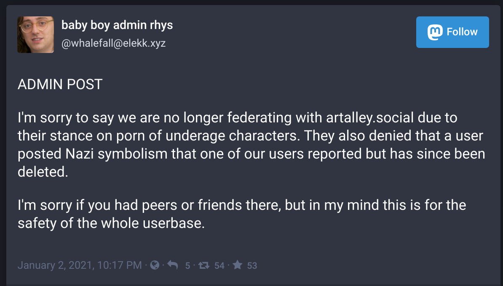
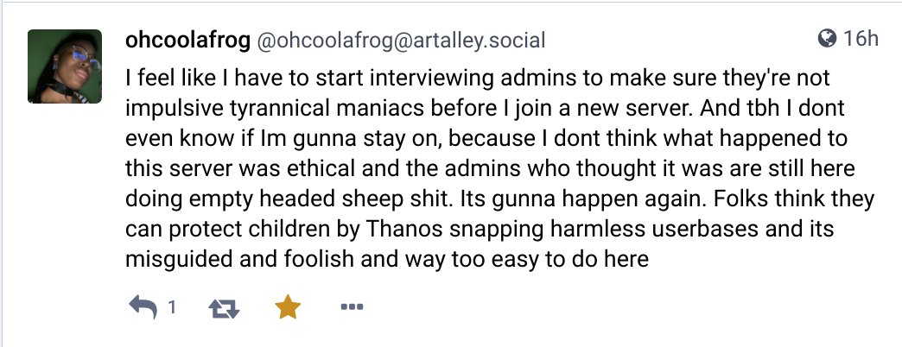
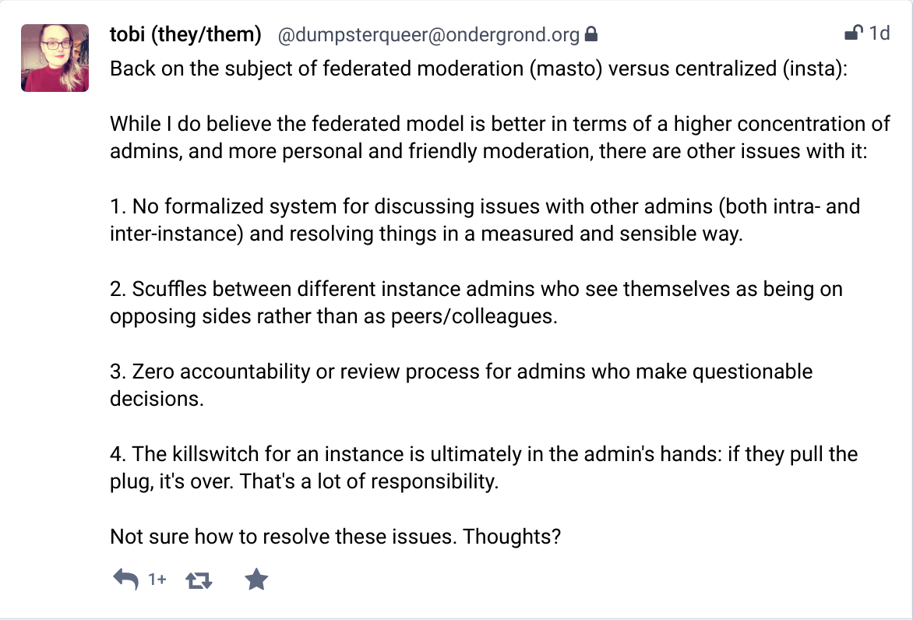
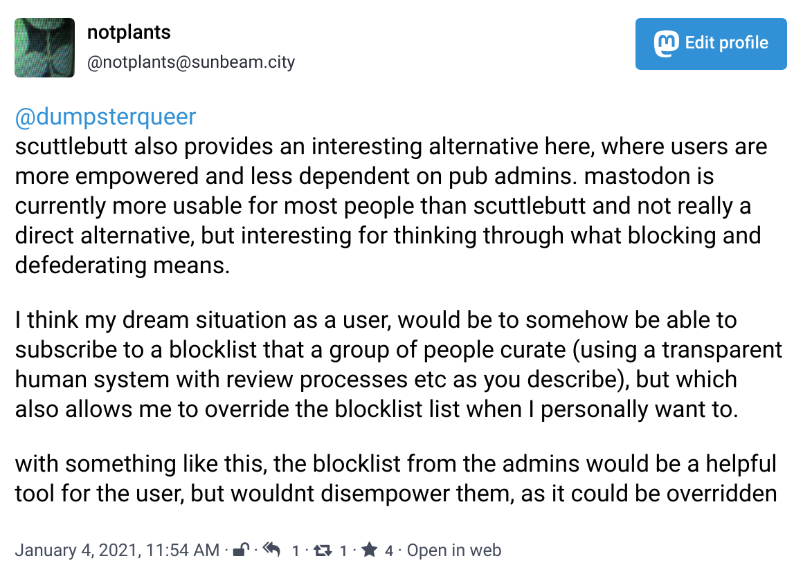

*content warning: this post includes mentions of pokemon porn, possibly depicting characters who are underage (the question of their age is the source of the conflict), but the images themselves are not included*

This is a brief account of an event that occurred in the [fediverse](https://en.wikipedia.org/wiki/Fediverse) on January 2nd of 2021, shared as an example to think through the dynamics of blocking, federation, and decentralized networks in general. 

If you haven't heard of the fediverse before, here is an article about it. In short, its a federated social network, where there are many instances (servers) and each server has its own admin(s) who decide which other instances to federate with. Users of a particular instance can see posts from their own instance, as well as other instances which their instance federates with. You can imagine it as a network of connected communities. A federation.  

If you don't like your admin's federation choices (too strict, or not strict enough), or for any reason, you can also migrate your account to another server. 

In a sense, federation combines "free speech" with "free listening". Anyone can create their own server and say whatever they want into the void, and at the same time no one has to listen to them (federate with them). 

So with this brief background, now into the details of the particular incident. Just the T. 

Artalley.social is an instance with 12,600 users (pretty large for the fediverse) which describes itself like this:

> *Art Alley* is a Mastodon server for *artists and commissioners*, as well as people who just like looking at art. Share your finished pieces, works in progress, changes to your commissions status and your livestreams, or whatever else you want, really!

They also say adult art is welcome, and they have a [code of conduct](https://artalley.social/about/more). 

Apparently, someone on artalley.social posted a pornographic drawing of a pokemon character who is underage. 

An admin of another instance saw this image, and reached out to the admin of artalley.social to report the image. 

The admin of artalley.social said that the image depicted a character who was underage according to canon, but the image was of the pokemon physically at a later age, and so was not against the rules. 

In response to this, the admin of elekk.xyz decided to defederate from artalley.social, and made a post about why there were defederating. 

source: https://elekk.xyz/@whalefall/105488202284424171

This post circulated around the fediverse, and others weighed in with additional evidence of the failings of the moderators of artalley.social with a recommendation to block the instance. 

e.g. this post with many screenshots [the supervillainess: You Should Defederate From artalley.social](https://sunbeam.city/web/statuses/105497156571374148)

As you can see in the posts above, the block recommendation takes a form similar to a legal argument -- with evidence/screenshots (receipts) and an explanation for why the evidence is worthy of a block. 

This is a common pattern on the fediverse. 

Block recommendations get shared around the network, which other instance admins may or may not follow and/or re-share. 

A decentralized court by screenshot.

~ ~ ~ ~ ~ a quote to pass the days ~ ~ ~ ~ ~ ~

In addition to the arguments recommending to block the instance,  I also saw posts from users complaining about the block, as they would have to change instances, when to them it seemed unfair that 12k users would have to change instances because of the bad actions of one user. 

For example, "ohcoolafrog", an artist I was following, posted this: 

Currently artalley.social server appears to be down, maybe the admins took it down. So I'm not sure what happened to ohcoolafrog. Maybe I will find them again on another instance someday. 

~ ~ ~ ~ ~     a quote to pass the days ~ ~ ~ ~ ~ ~

The thing that inspired me to write this, was [a post](https://ondergrond.org/@dumpsterqueer/105491747322124960) from an admin of ondergrond.org, a queer instance in belgium, about their thoughts on this process. 

My current view is that moderation would work best like this:

source: https://sunbeam.city/@notplants/105497077449053429

~ ~ ~ ~ ~ a quote to pass the days ~ ~ ~ ~ ~ ~

To zoom out for a second, something I find beautiful about the fediverse, 

is that its a place where these questions are being asked and lived out. 

Whether pokemon porn should be judged by the age of the character according to canon or according to the contents of the image is not the most interesting question to me, 

but how this question gets answered, becomes a case-study for a deeper set of questions about  moderation and the network itself. 

On centralized platforms there isn't nearly as much transparency. 

When a post gets banned, it often just disappears.

When something gets shadowbanned, we may not even know its happening. 

I invite the question that perhaps central platforms just hide the politics of the messy reality from view. 
Like so many capitalist "solutions" do. 
Like the trashbin, the one-click-delivery, the polished rectangle. 

Algorithms are a sweet poison. 

<3

Further Reading: 

- [Center for a Stateless Society &raquo; Social-Anarchism and Parallel Economic Computation](https://c4ss.org/content/52963)

- "Algorithms are a sweet poison" is a phrase I learned from [@kawaiipunk](https://sunbeam.city/web/accounts/38480)

If you would like to join the fediverse, 
[kolektive.social](https://kolektiva.social/) and [ondergrond.org](https://ondergrond.org/about) are two queer instances 
that are currently open for registrations. 

Or message me if you would like an invite to join [sunbeam.city](https://sunbeam.city/).