I spent the past month in New Mexico — in Albuqurque for a week, then 10 days at a ranch in Carrizozo, where I spent a lot of time sewing.

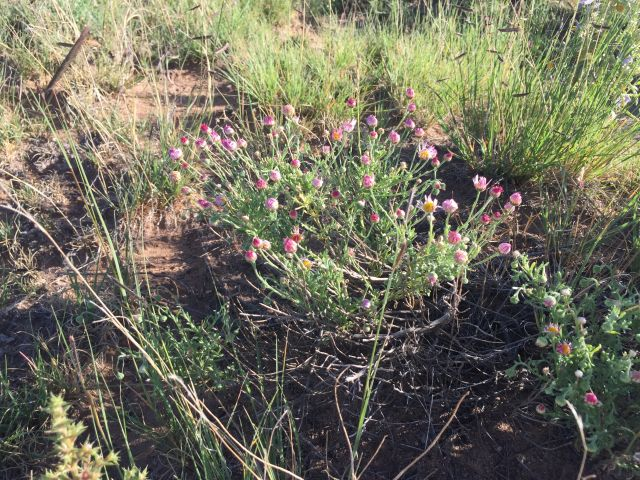

For the past three years Palace has had an annual 10 day residency taking place in Poland with around 250 people. The purpose of the project this September was to develop groundwork for a new residency that will take place in Carizzozo next September, and I came along to help out. There were around 20-30 people who were with the group at different points, many from Europe and many from New Mexico. People arrived and left at different points based on their availability. This development month was funded by 15,000 dollars loaned from patrons who wanted to support the project, and the basic arrangement was that if you could pay your travel to get there, you would be provided with food and accommodation while you were there helping out. Some of the Palace organizers were also working on applying for grant funding for the future, but for the most part it was a pretty decentralized group, converging via a shared vision.

I appreciated that the organizers put out a clear open call with what dates the group would be in which locations, but leaving a lot of space for what would happen once we were there — both because it was unknown, and because they wanted to leave room for input and direction from whoever showed up and from New Mexicans we met through outreach along the way.

The first week in Albuqurque the group primarily congregated around Tortuga gallery, in a large room working on their computers. In the second two weeks we went to Pino Ranch in Carizzozo, which is the planned site for the future residency. The Pino family is interested in creating a residency at the ranch mostly because they would like see the space being used by a creative community and want to support that. As part of the exchange, Palace also offered to build structures which will be of use to the Pino family throughout the year, and to do some repairs such as fixing the roof on an old barn.

The structures that exist at the ranch are pretty minimal. It’s not some big complex, but rather one house and a lot of space with some abandoned cattle-related stuff and barbed wire fences. There is a lot of open space and not a lot of shade. Most of the build related projects we were working on there had something to do with shade. It would get really hot in the day and everyone wore big hats, and cold enough at night that I was wearing multiple layers while sleeping in my tent.

Despite being harsh conditions in a way, its also very beautiful and full of life. While I was there, I saw two tarantulas, lots of beetles, stick bugs, birds, two snakes, lizards, grasshoppers, a beautiful hare with long ears, and lots of flowers.

The main build project we ended up completing was putting in tall 4x4 wooden posts into the ground with concrete bases, which would hold up a giant patchwork of cloths we made from sewing together lots of fabric and sheets from thrift stores, to give shade to a series of wooden tables and benches we also made (I use “we” here liberally, I mostly was sewing). A banquet area so that around 50 people could eat together. I appreciated that this was the primary orienting project, creating a space for a communal meal felt like building a keystone. On the last night before breakdown, we ate dinner at the table beneath the shade structure — the table was much too large for the size of our group that was there which felt fittingly symbolic for the idea of an open community.

With so many of us there and so little shade at times I felt claustrophobic — I found relief when I identified this feeling and started calling it ranch fever. It was interesting to see the dynamics of people building together, both professional builders and people with less experience. I appreciate that the lead of the build team (Jackie) is a woman, and did a really good job deflating some of the ego and gender related energy that can emerge with Construction. We also had three performance nights along the way where different people played music, read poetry and danced, as a form of outreach, and as a way to enjoy each other. On the last performance night, I poured concrete with a friend into a tire to put up a “mobile shade” fence post, while two other friends danced around us in front of a projection. It was inspired by the day before, where in the middle of pouring concrete I had got distracted and starting dancing with Franz around the shade pole until Jackie reminded me were in the middle of something.

I feel a conclusion reaching out like it wants me to find one. I could say something about being in community through ups and downs. I could say something about dishes and communal experiments. About my attraction to non-institutional creative communities. Or about going for a run each morning, and 15 minutes away from ranch fever how silent it is out there. I have lots of memories of the textures of fabrics while sewing.

I hope that this project continues to grow and to get the chance to spend more time there next year.

In search of and with gratitude for creative community and spiky flowers,  
M

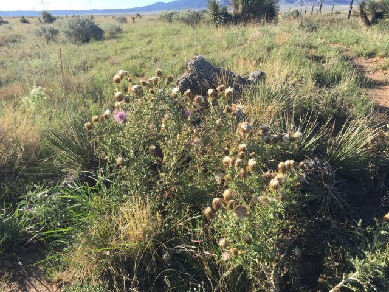
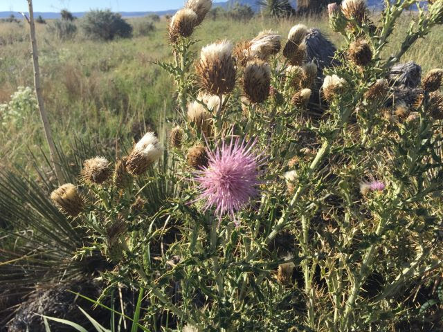
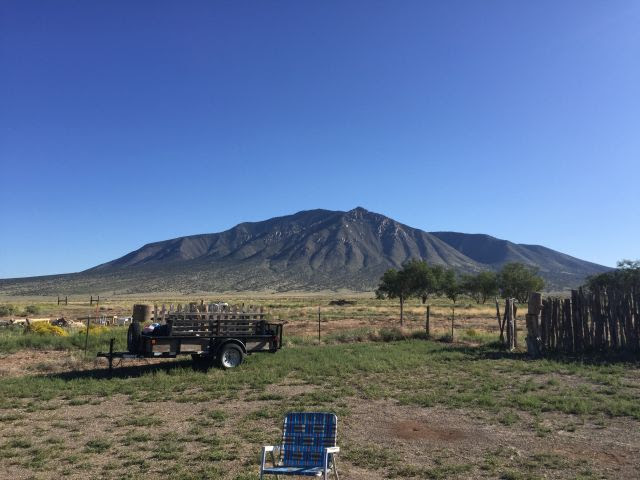
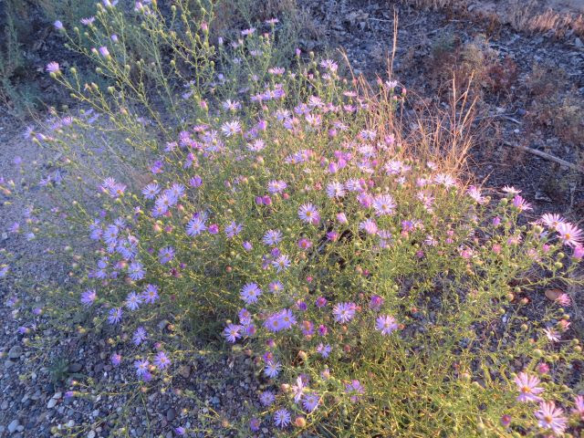
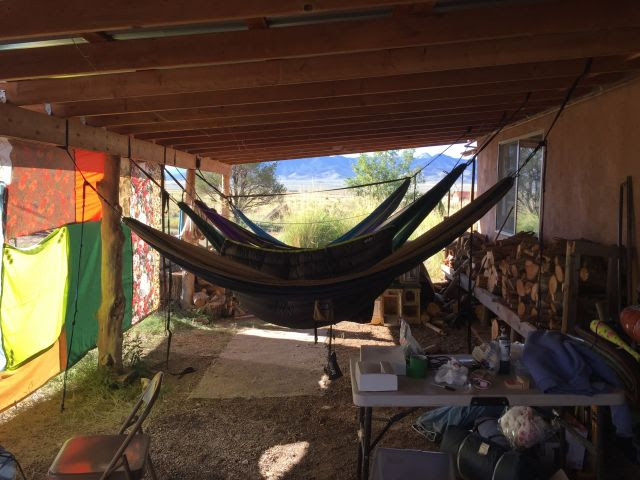
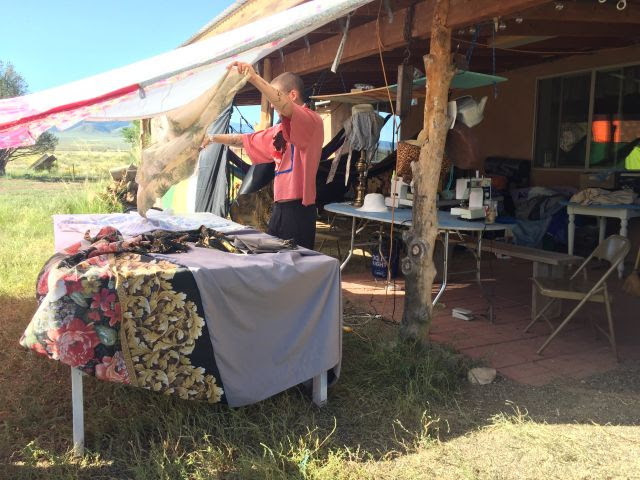
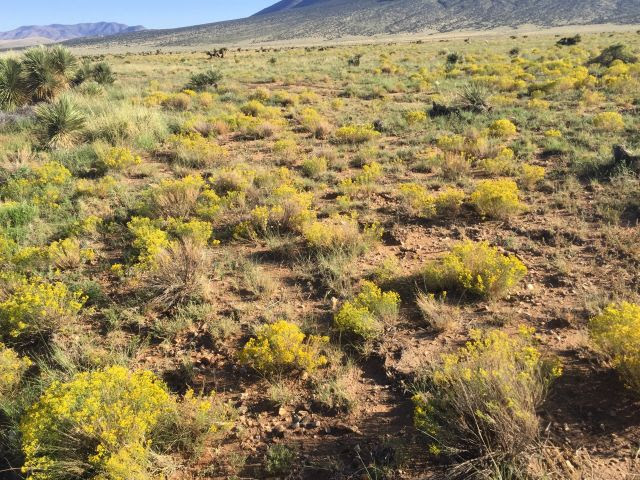
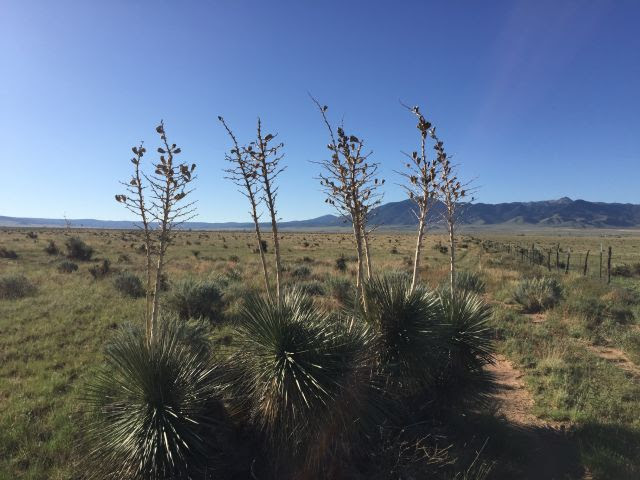
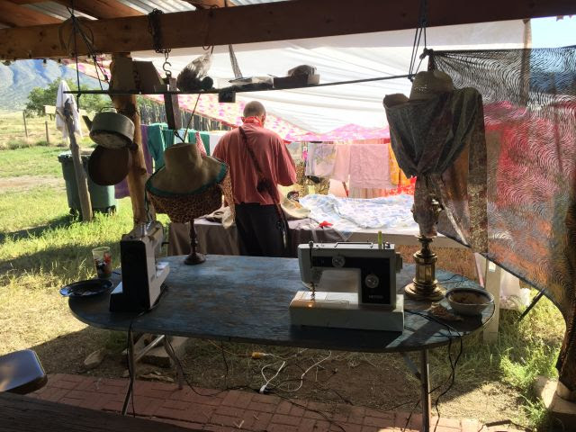
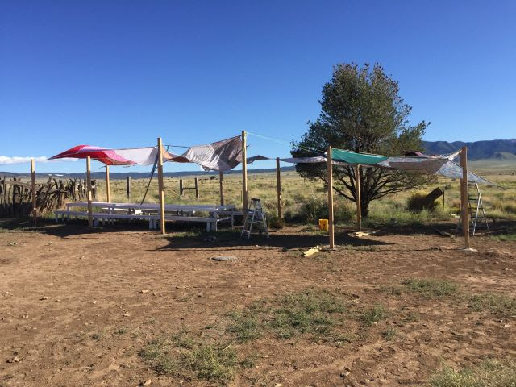
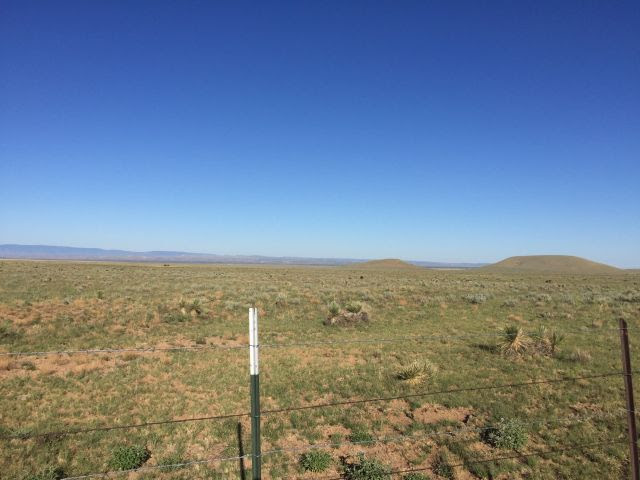