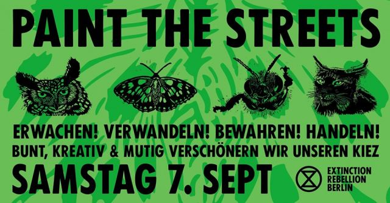

This Saturday I was hoping to organize an event at Sari-Sari in support/alignment with a decentralized Extinction Rebellion action happening that day called “Paint The Streets”

The idea of paint the streets is to put chalk spray paint, stickers and flyers around the city to raise awareness for the [synchronized set of XR actions](https://extinctionrebellion.us/rebels-without-borders) beginning October 7th at the same time in Berlin, Amsterdam, London, Paris and New York. 

Paint The Streets is one of many initiatives intended to help more people learn about the upcoming protests so that they can form affinity groups in the coming weeks and participate. 

For me Paint The Streets has become an interesting exemplar of my ongoing interest in how decentralized organizing works. Images for XR stickers and flyers are available online so technically anyone could go and print these stickers out and put them up anytime, but organizing an event to do so facilitates alignment and momentum, and if lots of people participate all throughout the city at once it might have a more visible effect than individual people putting up stickers at different times. 

Instead of organizing my own event, I also could have simply joined one of the pre-existing meet-ups where people were gathering for Paint The Streets, essentially being an individual contributor. I was interested in organizing an event at Sari-Sari because it seemed like a nice way to contribute to this action with friends -- to form an independent group that was also aligned with something beyond itself. Part of what's interesting about decentralization to me is that I wouldn't even need to tell the original organizer of the Paint The Streets action that I was organizing my own event -- by simply organizing the event on the same day it would be in alignment. 

This idea reminds me of murmurations, as described in [Emergent Strategy](https://www.amazon.de/Emergent-Strategy-Shaping-Change-Changing/dp/1849352607/ref=sr_1_1?keywords=emergent+strategy&qid=1567724013&s=gateway&sr=8-1) by Adrienne Maree Brown:

> My dream is a movement with such deep trust that we move as a murmuration, the way groups of starlings billow, dive, spin, dance collectively through the air—to avoid predators, and it also seems, to pass time in the most beautiful way possible. When fish move in this way, they are shoaling. When bees and other insects move in this way, they are swarming. I love all the words for this activity.
>Here’s how it works in a murmuration/shoal/swarm: each creature is tuned in to its neighbors, the creatures right around it in the formation. This might be the birds on either side, or the six fish in each direction. There is a right relationship, a right distance between them — too close and they crash, too far away and they can’t feel the micro-adaptations of the other bodies. Each creature is shifting direction, speed, and proximity based on the information of the other creatures’ bodies.
>There is a deep trust in this: to lift because the birds around you are lifting, to live based on your collective real-time adaptations. In this way thousands of birds or fish or bees can move together, each empowered with basic rules and a vision to live. Imagine our movements cultivating this type of trust and depth with each other, having strategic flocking in our playbooks.

Questions about organizing and aligning with something larger than myself have been recurring for me in the past year. Particularly over the past few months as I've been going to different XR meetings in Berlin trying to learn how it works and how I could contribute. 

I get the feeling that there is a subtle art to balancing independence and alignment. If you act in a completely decentralized fashion, if you go protest alone (or simply reduce your own individual consumption), you don't have much power. If you try to contribute by only following specific instructions from a centralized organizer, this may also not be the best. At some point your best contribution is to become a listener and also an organizer -- to listen to the broader patterns and also to take your own initiative, to move as a murmuration. 

This struck home with me when I realized that someone I knew gave a workshop about XR at Floating University because they independently applied to give the workshop, their application was accepted, and then they ran a really beautiful workshop for around 50 people. This type of self-initiative in some ways defies the logic of top-down organizing. 

I didn't end up organizing the Paint The Streets event at Sari-Sari because I decided to leave Berlin for the month of September to participate in this project in New Mexico (I just arrived back in the US today). But I wanted to share this idea, perhaps someone else will manifest it or it can manifest in a different way at a later date. 

I imagine a network of communities each with their own interests, also aligning to create power together,  
M