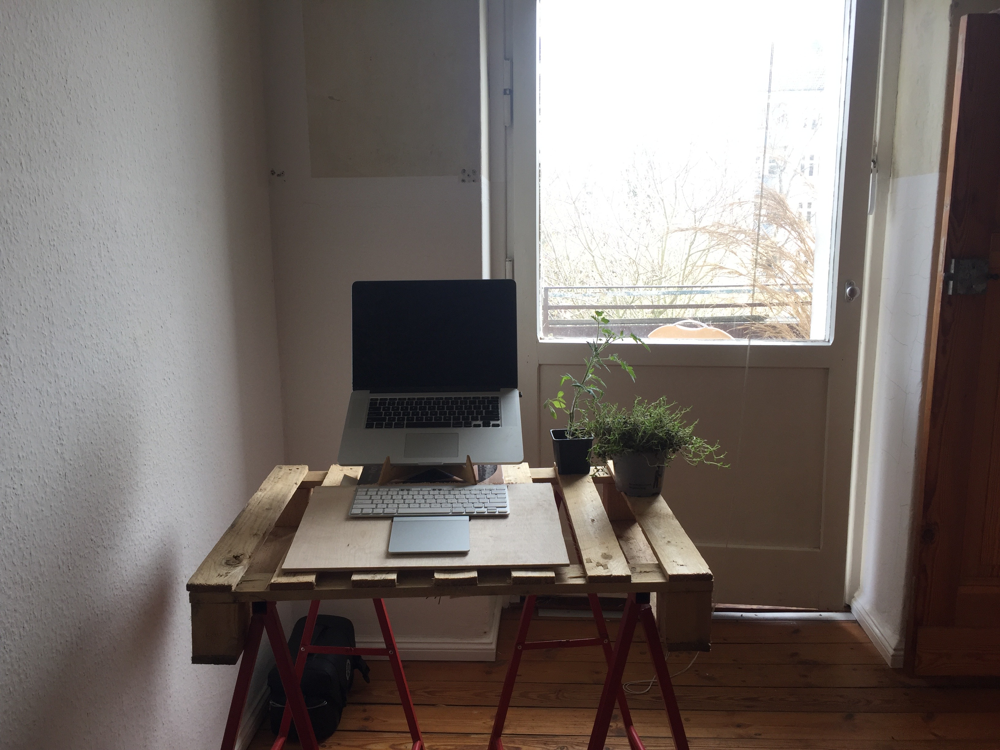
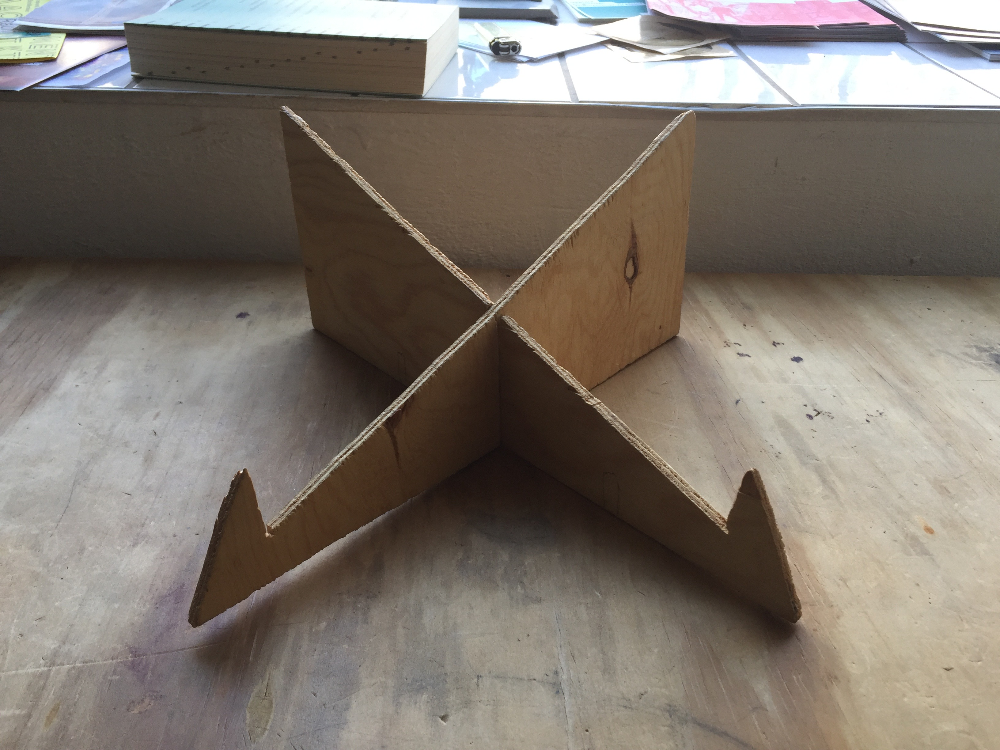

In 2017, my neck and back started hurting to the degree it was hard for me to do basic things without pain. I knew the pain was connected with using my laptop. I decided to do a yoga class to see if that could help. At the end of the month long yoga class I went into a headstand for the first time and immediately heard a crack in my neck. I wasn’t able to move my head for the next week and it took months before I was not in pain again. It didn’t turn me away from yoga, just needed to be more patient.

Since then, I’ve learned a number of different things to avoid reinjury — mostly just keep the screen at eye height — but the injury is always still somewhat there. This winter, while being very mindful to use my computer stand when working, I started getting wrist pain for the first time that prevented me from working.

Eventually I found that for me using a track pad, and computer on a stand, means no wrist pain and no neck pain. The location of the injury, the neck, seems like an obvious symbolism of the disconnection between head and body, which is also in a sense what the computer represents.

I wish that when I had first learned programming in school, someone had told me seriously to keep the screen at eye height, that you really need your neck. Along with a million other things it would have been nice to be told but you live and you learn.

I’m still learning what a healthy relationship with my computer could mean physically and emotionally. After living for a month without internet in my home, alone, during a pandemic, and then getting internet, I feel appreciative of the internet right now. I imagine periods of abstinence, balance, finding new non-extractive platforms, exploring, in variations for many years.

I’m thankful for these two pieces of wood that I cut with a jigsaw in 2018, and have been keeping my computer propped up and my neck mostly functioning since then.

  

