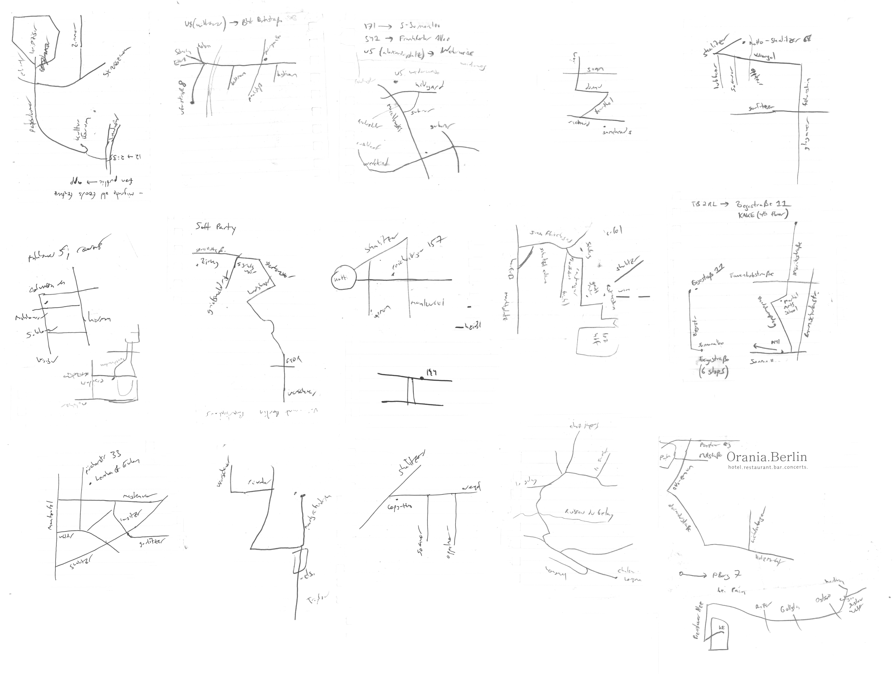
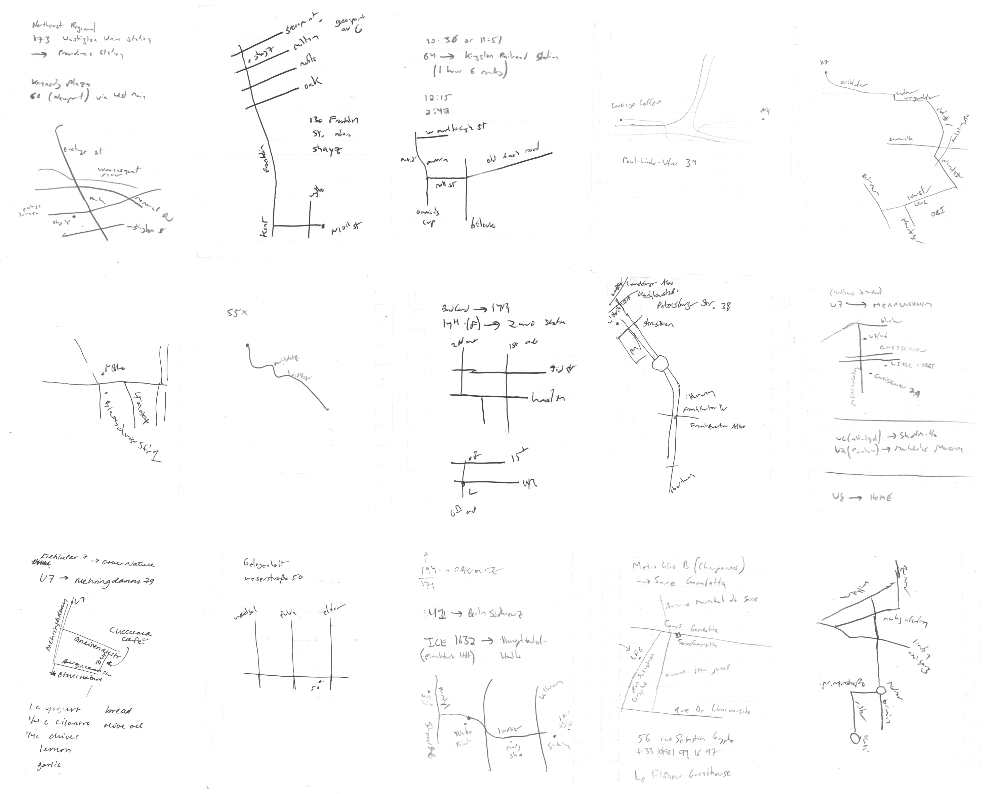
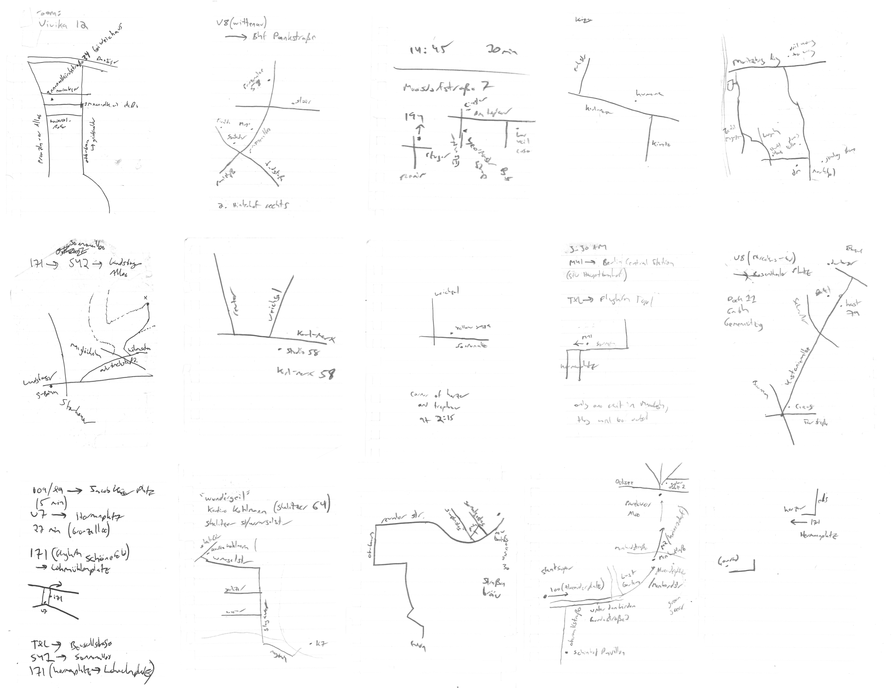

The origin of all maps is direct experience. Direct experience is a source of knowledge and energy which is always available and has no substitute.[^1] 

This is a reflection into my ongoing experiments changing my relationship with phones, screens and the internet, as a way of reconnecting
with this well.
What are the pathways immediately around us that lead to information being transmitted into our eyes and ears? 
What effects do these structures have on us? 
What agency do we have in how we relate to them? 



```
Must've skipped the ship and joined the team
For a ride
A couple hours to learn the controls
And commandeer both my eyes
Hey!
```
[^2]
 

On November 18th of 2018
I decided that I would try to use a flip-phone for somewhere between three months and a year, 
along with keeping a journal of emotions that arose for me during the process, 
marking on a calendar any days where I used my smart phone, 
building [a robotic machine](http://mfowler.info/work/disconnection-practices) which physically childblocks your smart phone, 
and creating a collection of all the maps I drew for navigating the city while using the flip-phone.





According to the journal, on December 14th, I imagined titling this collection of activities _The Origin Of Maps_, here is my note from that day:

>12/14/18 (friday)  
>thought of the title The Origin Of Maps  
>a reference to direct experience, where all maps, originally, come from  
>by the time we see an address inputted into Google Maps,  
>there have been many layers of mediation   
>The Origin Of Maps invites a return to direct experience  
>using the flip phone, you have to think of who you want to text or call  
>like imagining a UI based on blank screen   
>the only ideas that surface are the ideas that originate from you  

For me, using a flip-phone was an effort to call into question what is truly nourishing
and not passively accept the status quo.
I didn't want to do something speculative. 
Even if small, I wanted to make a concrete change to my life to prioritize direct experience and rest, a form of direct action.
I considered it more as a ritual in tribute to mindfulness than an experiment with a single result. 
I think many people overestimate how often a smart phone is necessary,
but it depends on what's happening in your life and I do not intend to make any universal claim.

I could tell that I exhibited certain compulsive negative habits with relationship to my smart phone,
and from VR to AI I could see that the tech industry was full of overhyped narratives. 
I questioned in what ways this surveillance-funded gadget made from rare earth metals was truly serving me.

Here are my journal entries from the first 10 days after I decided to use a flip-phone:

>day 1 (sunday)  
>picked up raspberry pi from kleinanzeigen and hung out with mylene   
>missed my turn on the way to kleinanzeigen pickup,    
>but used map in my bag to figure out where I had missed the turn   
>(felt like my rope harness catching me from falling)   
>  
>day 2 (monday)  
>took my iphone with me because I wanted to use a weird app   
>to text a weed dealer about buying weed   
>which I thought was only available on iphone   
>but turns out also has desktop version   
>  
>day 3 (tuesday)  
>took my iphone with me to studio because I was feeling like texting from the corner of the studio was nice  
>was feeling unsure about the project,   
>and frustrated that people were having trouble understanding how I wanted to be reached   
>in the evening left studio without my smart phone  
>felt rejuvenated by patty texting me updates to where the birthday party she was at was,   
>even though we had been messaging before on telegram.   
>she understood the system I wanted to use and laughed and told me it wasn’t that complicated   
>  
>day 4 (wednesday)  
>left my iphone at home in the morning   
>felt excited about project in general  
>as a way to provide some structure and direction to my life   
>to frame a period of life as research and ritual   
>  
>day 5 (thursday)  
>felt good to only have flip-phone during the day     
>and at night-time while returning to my apartment  
>was excited to see what messages i had received on telegram  
>  
>day 6 (friday)  
>using flip phone feels like gently scuba-diving away from my computer everyday  
>messaging during the day, it was not so difficult making plans for the weekend   
>  
>day 7 (saturday)  
>thought I had memorized directions, but realized I hadn’t memorized what to do after getting out of the u-bahn   
>successfully navigated the final part by asking strangers on the street for directions    
>  
>day 8  (sunday)  
>dan says “you are really making life complicated… flip-phone, veganism”  
>he tells me he and a friend have been writing a song for fun with the lyrics  
>“gimme me vegan ramen… fuck u…. vegan doc martens…. fuck u….  
>Berghain (it used to be better)…. 
>Sysyphous (it used to be better)….  
>About Blank (it used to be better)”   
>  
>day 9 (monday)  
>catherine lost her computer while on vacation and spent a week without computer or phone  
>she says she feels a bit feral, but in a good way. I feel like I can also feel a difference   
>she is dreaming of having no laptop,  
>just having her computer be in a physical location where it is used.  
>or of getting a job with her hands, becoming a cook   
>  
>day 10 (tuesday)  
>enjoyed getting coffee with Isaac, and baking a sweet potato for myself in the evening.  
>not sure if this deserves to be in the journal or not, but it felt nice to buy a single sweet potato, and take it home and bake it and eat half of it for dinner (with rice and beans) and then eat the other half for breakfast the next day with eggs  

<br/>

I also made a physical zine with <a href="http://cath.land">Catherine Schmidt</a> about
disconnection practices as healing practices. If you would like to read it, you can order a copy here:

--> [Disconnection Practices](/zines/disconnection-practices) 

&mdash; 

I also wrote a bit about ups and downs I went through of wanting to “end the project” and go back to using my smart phone at different points, and how ultimately I “gave up” in May but then two days later I went back to using my dumb phone by choice and I didn’t feel as agitated anymore when it was now no longer part of an experiment but just something I was doing and could stop whenever I wanted. 
I then continued to use the dumb phone for the rest of the year until November 29 of 2019, except for a period when I was in the US without a working sim card. 
I particularly look back highly on the first three months where I felt a lot of excitement and newness. 
I am currently using my smart phone again and I may take more time away in the future. 
I especially dream of being in more situations where I am so engaged with my surroundings that my smart phone ends 
up staying in my bag out of batteries for days without me noticing. Disconnection practices can be a tool to help us reconnect with our senses in the interim. 

<figure class="dumbPhoneWrapper" style="{{'maxWidth':'500px', 'display': 'flex', 'margin':'auto', 'margin-top': '20px'}}">
    
    <figcaption>"where are my books which dumb ass steals my books" - one of three text messages saved in drafts of used phone I bought on November 18 of 2018</figcaption>
</figure>

Related Resources:

- [Nap Ministry](https://www.instagram.com/thenapministry/) 
- [Flight Simulator](https://flightsimulator.soft.works/)
- [Empty Day](https://emptyday.today/) 


[^1]: As a short philosophical digression, one could argue that even our "direct" visual perception is mediated by culture and our past experience and so in some sense is also not direct. On the other hand, we all know the difference between hearing someone tell you what someone else said (a form of mediation) and hearing it directly. So like many philosophical questions, we can see that there is some ambiguity, but also like touching our nose with our finger or breathing there are lots of things we can do without knowing exactly how we do it, and we can still speak about a spectrum from more direct to less direct in a useful way. If I needed a definition of direct for this writing, it might be "without being recorded".   
[^2]: Lyrics from "Alien Days" by MGMT